<div align="center">

# 📚 Question Bank

**A local-first desktop application for building, organizing, and maintaining a large personal bank of exam questions, and turning it into ready-to-print exams.**


| 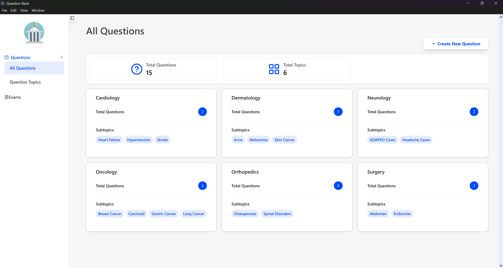 | 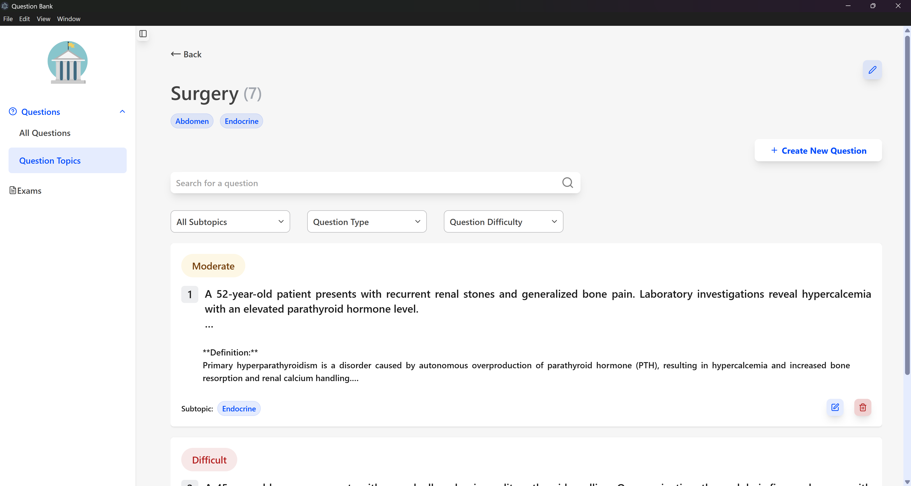 |

<div align="center">
  
  
</div>

</div>

---

## Table of Contents

- [Overview](#overview)
- [Features](#features)
- [Screenshots](#screenshots)
- [Tech Stack](#tech-stack)
- [Architecture](#architecture)
- [Getting Started](#getting-started)
- [Usage Guide](#usage-guide)
- [Data Storage, Backup and Restore](#data-storage-backup-and-restore)
- [Project Structure](#project-structure)
- [Extending the System](#extending-the-system)
- [Available Scripts](#available-scripts)
- [Security and Design Notes](#security-and-design-notes)
- [Troubleshooting](#troubleshooting)
- [Possible Future Improvements](#possible-future-improvements)
- [License and Author](#license-and-author)

---

## Overview

**Question Bank** is a desktop application for educators who maintain a large, categorized collection of questions and need to assemble exams from it quickly and without repetition.

Questions are organized by **topic** and **subtopic**, rated by **difficulty**, and can include an optional header image. Exams can be assembled manually, generated automatically from criteria, or built by combining both approaches. Finished exams are exported to a formatted Word document containing a student version and a teacher version with model answers.

> **Scope:** Question Bank is built for **personal, single-user use**. All data lives in a local SQLite database on your machine. There is no server, account system, or cloud sync, and it is not designed as a shared bank between multiple teachers.

---

## Features

### Question bank

- **Two question types:** Multiple Choice (MCQ) and Essay. The type system is designed to be extended (see [Extending the System](#extending-the-system)).
- **MCQ:** five unique choices per question, exactly one of which is correct.
- **Essay:** a model answer stored alongside the question.
- **Difficulty rating** per question (easy, moderate, difficult).
- **Optional header image** per question, with live preview before saving.
- **Full CRUD:** create, edit, and delete questions. Replacing or deleting a question also removes its stored image, so no orphaned files are left behind.
- **Copy images out of the app:** right-click a question image and choose _Copy Image_ to paste it directly into Word, PowerPoint, or any other application as a real picture.

### Categorization

- Two-level organization: **Topic → Subtopic**.
- Create, rename, and delete topics and subtopics.
- Referential protection: a topic or subtopic that still contains questions cannot be deleted by accident.

### Exam builder

- **Three ways to build an exam:**
  1. **Manual:** browse the question bank and pick questions.
  2. **Automated:** define criteria rows (number of questions, topic, subtopic, difficulty) and let the system randomly select matching questions.
  3. **Mixed:** combine both approaches in the same exam.
- **Exclude previously used questions:** choose past exams whose questions must not reappear in the new one.
- **No duplicates within an exam:** questions already added to the exam are excluded from automated generation.
- **Clear feedback:** if a criterion cannot be satisfied (for example, not enough matching questions), the error points to the exact criterion row.
- Each exam has a single question type, a target question count, and a **draft / final** status.
- Edit exams after generation: rename, add, and remove questions.

### Word export

- Export any exam to a `.docx` file through a native _Save As_ dialog.
- The document contains the **student version** (questions, choices, answer space) and the **teacher version** (correct answers and model answers).
- Question images are embedded at their original size, scaled down proportionally only when they would overflow the page, so the aspect ratio is always preserved.
- Export layout lives in one place and is easy to customize.

### Performance and user experience

- **Server-side filtering and search** in SQLite (indexed), with a debounced search box.
- **Pagination with limits:** each page fetches only the rows it needs, plus a total count from the same query.
- **Bulk detail loading:** MCQ and essay details are fetched in batches instead of one query per question, which removes the N+1 query problem.
- **List virtualization** (TanStack Virtual) so long lists render only what is visible.
- **Centralized query keys and query definitions**, so cache invalidation is managed in a single place.
- **Unsaved-changes protection:** navigating away from a form with pending edits prompts you first.
- Reusable UI components (shadcn/ui based) for a consistent interface.

---

## Screenshots

### Question bank

<div align="center">
  
  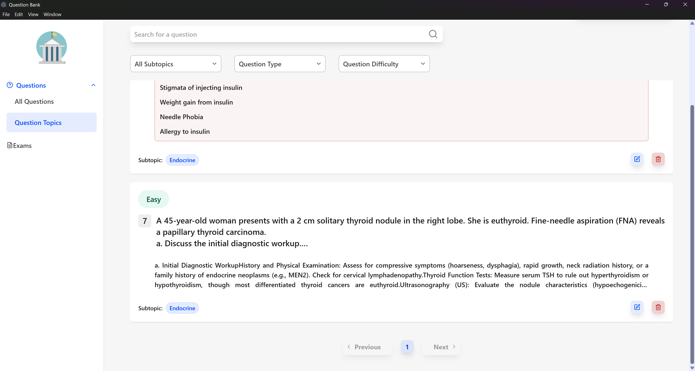
</div>

### Question form

<div align="center">
  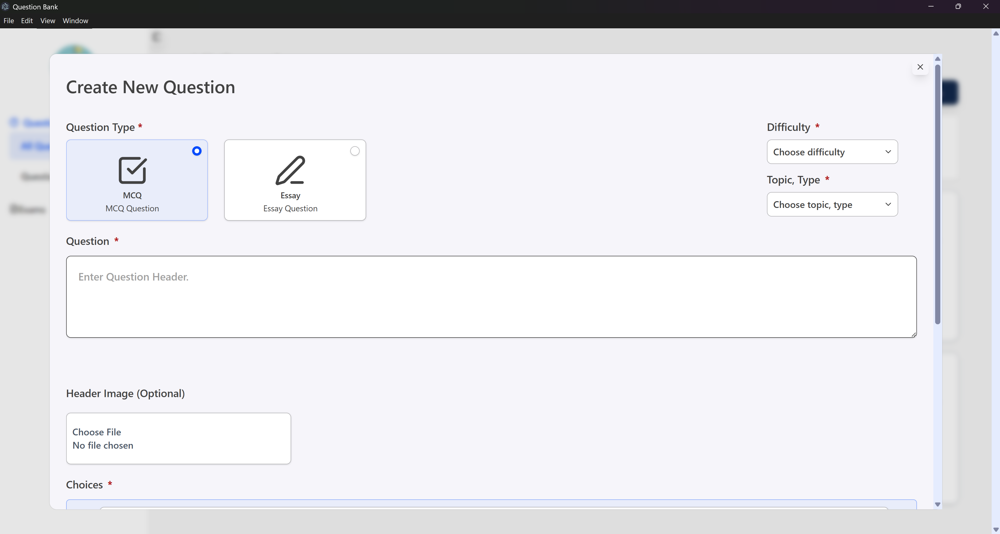
  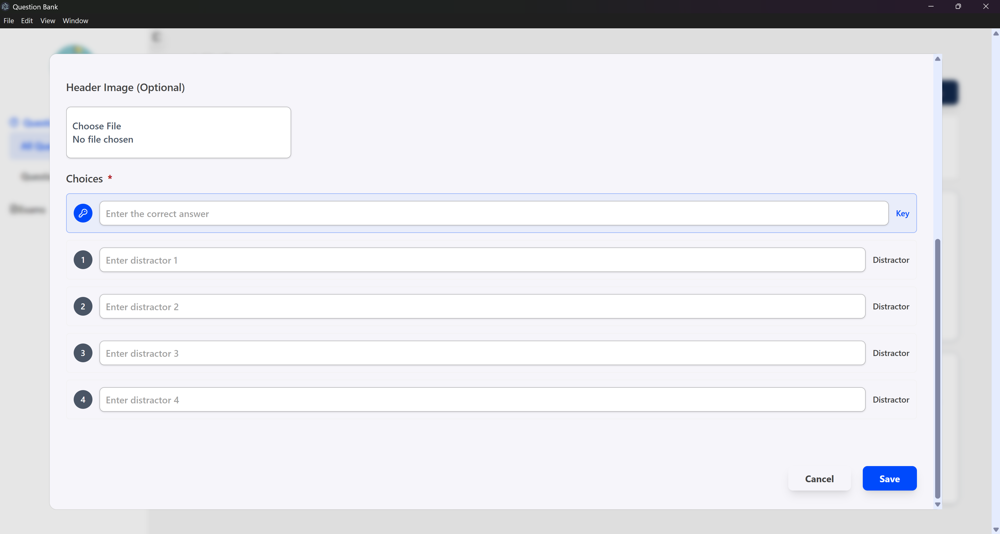
</div>
<div align="center">
  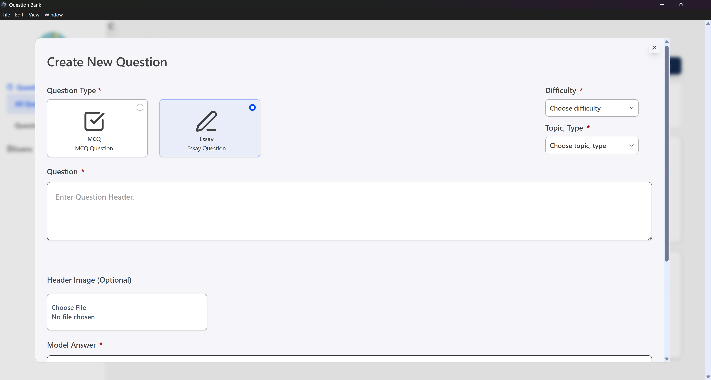
  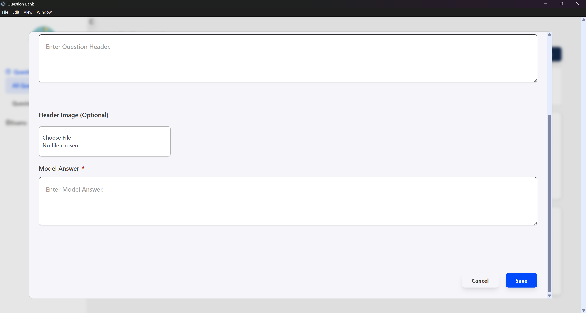
</div>

| Exams                                                             | Exam Form                                                                  |
| ----------------------------------------------------------------- | -------------------------------------------------------------------------- |
| 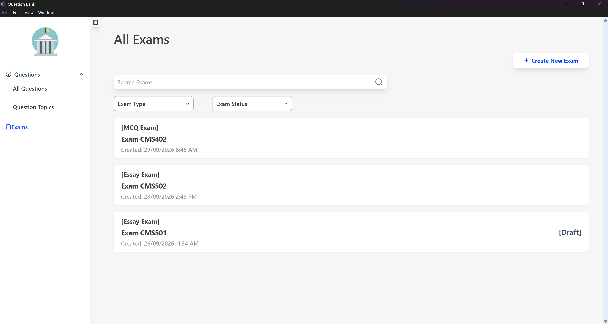 | 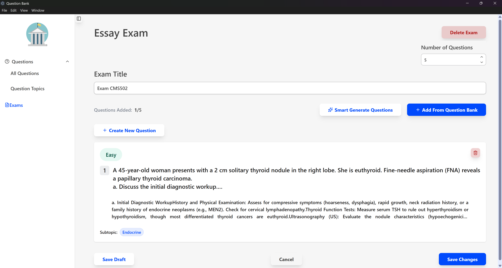 |

| Exam generation by criteria                                                | Add questions from the bank                                                    |
| -------------------------------------------------------------------------- | ------------------------------------------------------------------------------ |
| 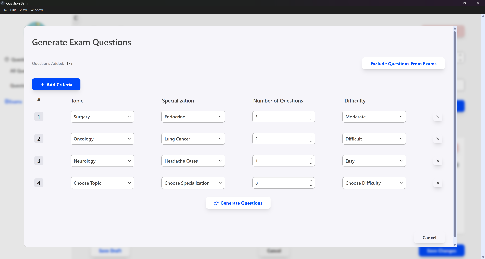 | 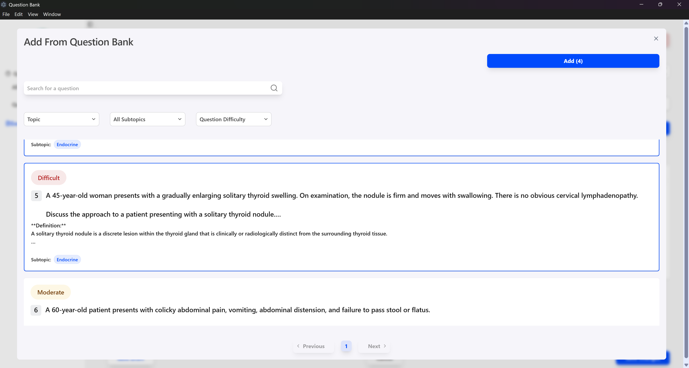 |

| Topics and subtopics                                          | Exported Word document                                       |
| ------------------------------------------------------------- | ------------------------------------------------------------ |
| 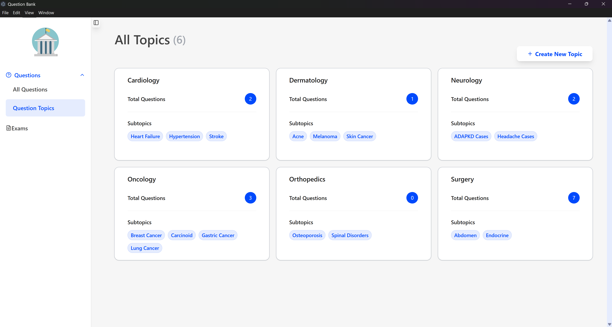 | 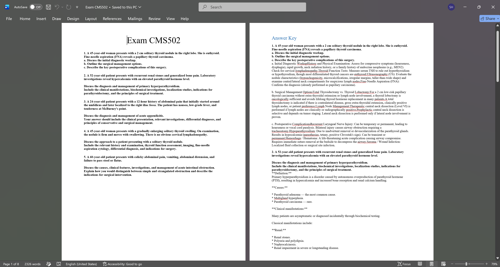 |

---

## Tech Stack

| Layer                   | Technology                                                      |
| ----------------------- | --------------------------------------------------------------- |
| Desktop shell           | Electron 44 (context isolation, preload bridge)                 |
| UI                      | React 19, TypeScript, Vite                                      |
| Styling / components    | Tailwind CSS 4, shadcn/ui (Radix), lucide-react, Sonner         |
| Routing                 | React Router 7 (hash-based routing for `file://` compatibility) |
| Data fetching / caching | TanStack Query                                                  |
| List rendering          | TanStack Virtual                                                |
| Forms / validation      | React Hook Form, Yup                                            |
| State                   | Redux Toolkit                                                   |
| Database                | SQLite through `better-sqlite3` (synchronous, main process)     |
| Word export             | `docx`, `image-size`                                            |
| Packaging               | electron-builder (Windows, macOS, and Linux installers)         |

---

## Architecture

The renderer (React) never touches the database or file system directly. Every operation goes through a typed IPC bridge to the Electron main process, which owns all data access.

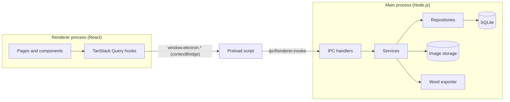

**Key design decisions**

- **Layered main process:** IPC handlers stay thin, services hold business rules, and repositories own all SQL.
- **Typed IPC results:** handlers return `{ success, data }` or `{ success: false, message, cause }` instead of throwing across the process boundary, because Electron rewrites thrown error messages during IPC. The renderer unwraps results into normal errors.
- **Versioned migrations:** the schema is applied through ordered migrations tracked with SQLite's `PRAGMA user_version`. Never edit an existing migration; append a new one.
- **Managed image storage:** uploaded images are copied into an app-controlled folder under generated unique filenames. The database stores only the filename, and a custom `app-image://` protocol serves the files to the UI.
- **Transactional writes:** multi-table updates (for example, editing an exam and its question list) run inside a single transaction.

**Database schema**

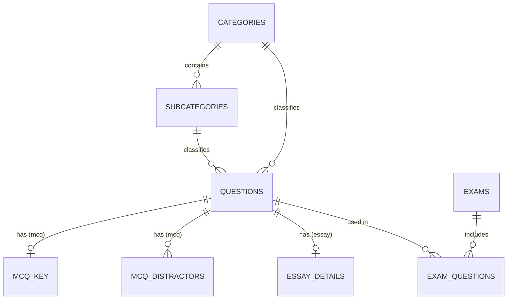

Indexes cover the hottest query paths: question lookups by category, subcategory, difficulty and type, distractor lookups by question, and exam membership lookups.

---

## Getting Started

### Prerequisites

- **Node.js** 22 LTS (or 20.19+). The toolchain (Vite 8, ESLint 10, TypeScript 6) requires a recent Node version.
- **npm** 10+
- **Git**
- **Operating System:** Windows, macOS, or Linux for development. Electron supports all three platforms.
- **To build a platform-specific installer:** use the operating system corresponding to the target platform, or configure electron-builder for cross-platform builds where supported.

- _Only if a prebuilt_ `better-sqlite3` _binary is unavailable for your Electron version:_ Python 3 and the Visual Studio Build Tools ("Desktop development with C++") may be required on Windows.

### Installation

```bash
# 1. Clone the repository
git clone https://github.com/SheroukHesham/question-bank-desktop-app.git
cd question-bank

# 2. Install dependencies
npm install

# 3. Rebuild native modules against Electron's Node ABI
npx electron-builder install-app-deps
```

> **Why step 3?** `better-sqlite3` is a native module and must be compiled for Electron's runtime, not your system Node. Skipping this causes a `NODE_MODULE_VERSION` mismatch error at launch. To automate it, add `"postinstall": "electron-builder install-app-deps"` to the `scripts` in `package.json`.

### Run in development

```bash
npm run dev
```

This starts the Vite dev server (`http://localhost:5123`) and the Electron app together. The database and image folders are created automatically on first launch, and migrations run on startup.

> **Note:** the Electron main-process code is compiled once when `npm run dev` starts. After changing files under `src/electron`, stop and restart the command. React changes hot-reload automatically.

### Build the installers

Build a platform-specific installer using the corresponding npm script:

**Windows (x64)**

```bash
npm run dist:win
```

**macOS (Apple Silicon / arm64)**

```bash
npm run dist:mac
```

**Linux (x64)**

```bash
npm run dist:linux
```

This compiles the Electron code, builds the React app, and packages an x64 installer with electron-builder. The installer is written to the electron-builder output directory (`dist/` by default, unless your electron-builder configuration says otherwise).

---

## Usage Guide

1. **Create your structure.** Open the topics page and add topics, then subtopics under each.
2. **Add questions.** Choose a topic and subtopic, pick MCQ or Essay, set the difficulty, enter the header (with an optional image), and provide the choices or model answer.
3. **Browse and search.** Filter by topic, subtopic, difficulty, or type, and search question headers. Results are paginated.
4. **Create an exam.** Choose the exam type and the target number of questions, then add questions by:
   - **Picking from the bank** with _Add from Question Bank_, and/or
   - **Generating from criteria:** add criteria rows (count, topic, subtopic, difficulty), optionally select past exams to exclude, and generate.
5. **Refine.** Remove, add, or reorder questions, then save as a draft or mark the exam as final.
6. **Export.** Use _Export to Word_ and choose where to save the `.docx` file.

---

## Data Storage, Backup and Restore

All data is stored locally in Electron's per-user data directory (on Windows, typically `%APPDATA%\Question Bank\`):

| Item                      | Contents                        |
| ------------------------- | ------------------------------- |
| SQLite database file      | Categories, questions, exams    |
| `question-images/` folder | Uploaded question header images |

**Back up both items together.** The database stores only image filenames, so restoring the database without the image folder leaves questions with missing pictures.

**To back up:** close the application first (so SQLite finishes writing any pending changes), then copy the database file, any accompanying `-wal` / `-shm` files, and the `question-images` folder to a safe location.

**To restore:** close the application and copy the files back into the same directory.

---

## Project Structure

```
question-bank/
├── src/
│   ├── electron/            # Main process
│   │   ├── main.ts          # App bootstrap, window, custom image protocol
│   │   ├── preload.ts       # contextBridge API exposed as window.electron
│   │   ├── ipc/             # Thin IPC handlers (safeHandle wrappers)
│   │   ├── services/        # Business logic (questions, exams, image storage, Word export)
│   │   └── repositories/    # SQL access + database migrations
│   ├── shared/              # Interfaces and types shared by both processes
│   └── ui/                  # Renderer (React)
│       ├── pages/
│       ├── components/      # Reusable and shadcn/ui components
│       ├── hooks/
│       └── lib/queries/     # Centralized query keys and query definitions
├── dist-electron/           # Compiled main process (generated)
├── dist-react/              # Built renderer (generated)
└── package.json
```

---

## Extending the System

### Adding a new question type

1. Add the new literal to the shared question type (`TQuestionTypes`) and define its interface.
2. Add a **new migration** that creates a detail table for the type. SQLite cannot alter a `CHECK` constraint in place, so extending the `type` constraint requires a table-rebuild migration. Do not edit existing migrations.
3. Extend the repository's create, update, and bulk-detail-loading logic for the new type.
4. Add the form fields and validation schema in the UI.
5. Add rendering in the question card and a branch in the Word export builder.

### Customizing the Word export

The export service builds the document in small functions (question block, answer key, image sizing). Adjust these to change:

- Layout, fonts, headings, and spacing
- Maximum embedded image width and height
- Content of the student and teacher versions

---

## Available Scripts

| Script                       | Description                                    |
| ---------------------------- | ---------------------------------------------- |
| `npm run dev`                | Run Vite and Electron together for development |
| `npm run dev:react`          | Run only the Vite dev server                   |
| `npm run dev:electron`       | Compile the main process and launch Electron   |
| `npm run transpile:electron` | Compile the Electron (main process) TypeScript |
| `npm run build`              | Type-check and build the React renderer        |
| `npm run lint`               | Run ESLint                                     |
| `npm run preview`            | Preview the built renderer in a browser        |
| `npm run dist:win`           | Build and package the Windows x64 installer    |
| `npm run dist:mac`           | Build and package the macOS arm64 installer    |
| `npm run dist:linux`         | Build and package the Linux x64 installer      |

---

## Security and Design Notes

- **Context isolation** is enabled. The renderer only sees the explicit API exposed by the preload script.
- **Parameterized SQL** everywhere. User-entered search text is escaped for `LIKE` patterns.
- **Path-traversal protection:** image filenames are reduced to their base name before being resolved, so a corrupted value cannot read files outside the image folder.
- **Foreign-key enforcement** is enabled, protecting the data from accidental deletions.
- **Fully offline:** the app makes no network requests for its core functionality.

---

## Troubleshooting

| Problem                                                                    | Likely cause and fix                                                                                                                           |
| -------------------------------------------------------------------------- | ---------------------------------------------------------------------------------------------------------------------------------------------- |
| `was compiled against a different Node.js version (NODE_MODULE_VERSION …)` | Native module not rebuilt for Electron. Run `npx electron-builder install-app-deps`.                                                           |
| Blank window in the packaged app                                           | Routing or asset paths. The app uses hash routing, and Vite must be configured with `base: "./"`.                                              |
| Question images do not display                                             | Check that the custom `app-image://` protocol is registered before the window loads and that the image exists in the `question-images` folder. |
| Electron changes are not picked up in dev                                  | The main process is compiled once at startup. Restart `npm run dev`.                                                                           |
| Data seems missing after reinstalling                                      | Data lives in the user-data directory, not the install folder. Restore the database and `question-images` from a backup.                       |

---

## Possible Future Improvements

- Automatic application updates (for example, `electron-updater` with GitHub Releases)
- One-click backup and restore from inside the app
- Import questions from CSV or Word

---

## License and Author

Private project, all rights reserved.

Built by **Sherouk**.
